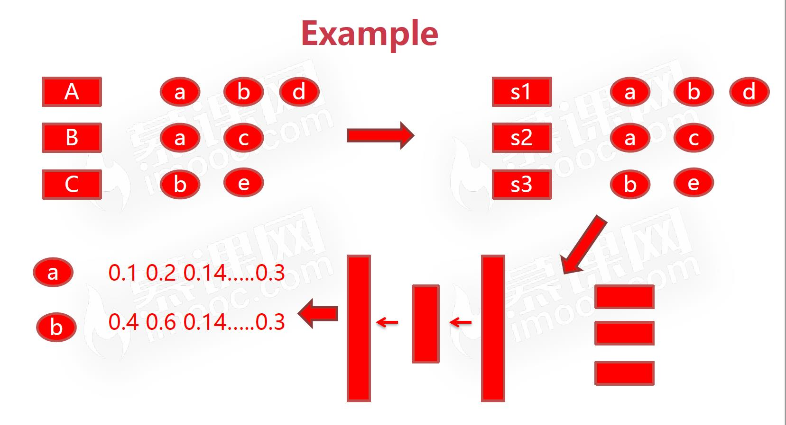
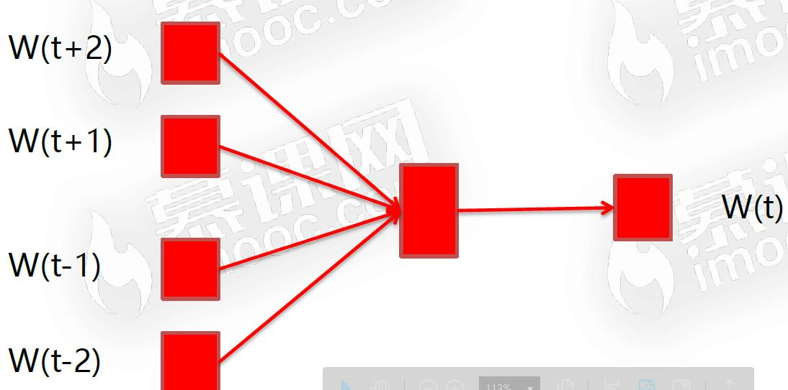

#### 背景

- Item2Item的推荐方式效果显著

- 神经网络模型的特征抽象能力

  - 隐藏层和输出层之间的网络都是全连接层的网络
  - 激活函数的非线性化

-  Item2Vec-Neural Item Embedding for Collaborative Filtering

  - 提出了Item2Vec落地场景

  - Item2Vec 所选的model，负采样方法训练

  - 抽象了算法的总体流程

  - 实验对比

#### 物理意义

- word2vec模型:语料中的词embedding成词向量，词向量的远近表示词与词的远近
	- 三层的神经网络
- 将用户的行为序列转化成item组成的句子
  - 用户一系列的行为，item与item之间的关系，像文字所组成的句子一样
- 模仿word2vec 训练 word embedding，将item embedding
  - 提供语料也就是文字放入w2v，训练出来的embedding可以表示词的远近
  - item之间语义内涵的远近
  - item组成的语料 ->w2v ，完成tem embedding，得出的向量可以表示item之间的远近，相似性
  - 缺陷
    - 用户行为序列时序性缺失
    	- 用户的行为转换为序列，打乱或者不打乱结果差不多
    - 用户行为序列中的item的强度是无区分性的
    	- 观看80%，50%，都是一次，卖或者加购物车可能都是一次
- Item2Vec算法主流程
	- 从log中抽取用户行为序列
		- 不同推荐系统代表的行为不同，信息流-点击，评分系统-评分大于几分，电商系统-用户购买
	-  将行为序列当成语料训练word2vec得到item embedding
		- 模型有很多参数是要自己去设定的
	- 得到item sim关系用于推荐
- exmple
	

#### Word2Vec Model

- CBOW(continuous bag of words)

  

  - 输入，投影，输出
  - 5个词，输入的训练数据w和上下文，投影层将上下文输入的向量加起来，每个词都初始化了一个向量，投影与输出是全连接

- 

  - xw

- Skip Gram Word2vec数学原理

  - 

